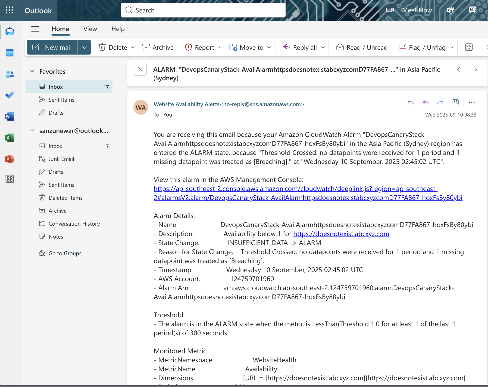

# Website Health Monitoring System – Final Report

## 1. Introduction
This project delivers a **website health monitoring system** using Amazon Web Services (AWS).  
The system checks if selected websites are online and measures how quickly they respond.  
When a problem is detected, the system raises an alarm and sends an email notification.  

The solution is built with cloud-native services:
- **AWS Lambda** – runs the Python function that checks the websites.  
- **Amazon CloudWatch** – stores custom metrics (availability and latency), shows dashboards,and raises alarms.  
- **Amazon SNS** – delivers notifications to users via email.  
- **Amazon DynamoDB** – stores monitoring results for logging and history.  
- **AWS CDK** – defines all resources as code, making the system easier to deploy and maintain.  

The project was created as part of the NIT6150 Advanced Project unit.
The focus was not only on building a working system but also on applying DevOps practices,
automation, and ethical considerations.  

---

## 2. Implementation Process
The system was developed in stages:  

1. **Environment Setup**  
   - Installed Python 3.12, Node.js, and AWS CLI.  
   - Configured AWS credentials using `aws configure`.  
   - Created a virtual environment and installed AWS CDK.  

2. **Lambda Function**  
   - Wrote Python code to check websites.  
   - Recorded **availability** (1 = up, 0 = down) and **latency** (milliseconds).  
   - Published metrics into CloudWatch.  
   - Stored results in DynamoDB (`URL`, `Status`, `Latency`, `Timestamp`).  

3. **CloudWatch Metrics**  
   - Custom namespace `WebsiteHealth`.  
   - Availability and latency metrics for each website.  

4. **CloudWatch Alarms**  
   - **Availability Alarm**: triggered if value < 1.  
   - **Latency Alarm**: triggered if value > 1000 ms.  
   - Configured for fast detection with one datapoint.  

5. **SNS Notifications**  
   - Created an SNS topic.  
   - Subscribed user email addresses.  
   - Confirmed subscription to start receiving notifications.  

6. **DynamoDB**  
   - Created a DynamoDB table.  
   - Lambda writes monitoring results after every run.  
   - Used to view historical records of checks.  

7. **CDK Deployment**  
   - Defined all resources in `devops_canary_stack.py`.  
   - Used `cdk bootstrap` and `cdk deploy` to create the stack.  

---

## 3. Testing and Verification
The system was tested to confirm correct behaviour:  

- **Functional Test** – Lambda executed successfully and wrote metrics + DynamoDB records.  
- **Alarm Test** – Simulated downtime by blocking a site; alarm went into ALARM state.  
- **Latency Test** – Verified that slow sites triggered latency alarms.  
- **Email Notification Test** – Received SNS alert emails when alarms were triggered.  
- **Data Storage Test** – Checked DynamoDB table to confirm results were logged.  

### Screenshot placeholders:
-   
-   
-   
-   
-   
-   
-   

---

## 4. Challenges and Solutions
Several challenges occurred during the project:  

- **Lambda Asset Path Error** – Deployment failed because the Lambda folder was missing.  
  *Solution*: Created correct folder structure and included code.  

- **SNS Subscription Issue** – Emails did not arrive at first.  
  *Solution*: Confirmed subscription manually; alerts worked.  

- **Alarms Trigger Only Once** – CloudWatch sends alerts only when state changes.  
  *Solution*: Adjusted configuration and expectations during testing.  

- **Git Push Rejection** – Remote repo was ahead.  
  *Solution*: Pulled changes before pushing.  

These challenges improved understanding of AWS services and real DevOps practices.  

---

## 5. Strengths and Limitations
**Strengths**
- Fully automated and serverless.  
- Uses managed AWS services, scalable and cost-efficient.  
- Provides both real-time alerts and historical logs.  
- Infrastructure is defined as code with CDK.  

**Limitations**
- Supports only email notifications.  
- Metrics collected every 5 minutes (not real-time).  
- DynamoDB used for logging but no visual dashboard.  
- Limited alarm configuration flexibility.  

---

## 6. Future Improvements
- Add **CI/CD pipeline** with GitHub Actions to automate testing and deployment.  
- Store results in **DynamoDB with TTL** and visualise data with Amazon QuickSight.  
- Add **multi-channel notifications** (Slack, Teams, SMS).  
- Provide a **self-healing option** where failed services can auto-recover.  
- Develop a **frontend dashboard** to display metrics for non-technical users.  

---

## 7. Computer Ethics Reflection
Ethical principles were considered during the project:  

- **Privacy** – Only public websites were monitored, avoiding user data collection.  
- **Transparency** – System measures only uptime and latency, not user behaviour.  
- **Consent** – If applied to private systems, owner permission is required.  
- **Responsible Use** – Care taken to avoid misuse or excessive requests to websites.  

These steps ensured the project met professional IT standards and ethical guidelines.  

---

## 8. How to Run the Project
To deploy in your AWS account:  

1. Clone the repository:  
   ```bash
   git clone https://github.com/<your-username>/VU_July2025.git
   cd VU_July2025/devops_canary


2. Set up Python environment:

   ```bash
   python3 -m venv .venv
   source .venv/bin/activate
   pip install -r requirements.txt
   ```

3. Bootstrap CDK (first time only):

   ```bash
   cdk bootstrap
   ```

4. Deploy with your email:

   ```bash
   cdk deploy -c alertEmail=your@email
   ```

5. Confirm SNS subscription from your inbox.

The system will then check websites every 5 minutes and send alerts if issues occur.
Results will also be logged in DynamoDB.

---


## 9. References

* Amazon Web Services (2024). *AWS Lambda Documentation*. \[online] Available at: [https://docs.aws.amazon.com/lambda/](https://docs.aws.amazon.com/lambda/)
* Amazon Web Services (2024). *Amazon CloudWatch Documentation*. \[online] Available at: [https://docs.aws.amazon.com/cloudwatch/](https://docs.aws.amazon.com/cloudwatch/)
* Amazon Web Services (2024). *AWS CDK Developer Guide*. \[online] Available at: [https://docs.aws.amazon.com/cdk/](https://docs.aws.amazon.com/cdk/)
* Amazon Web Services (2024). *Amazon DynamoDB Documentation*. \[online] Available at: [https://docs.aws.amazon.com/dynamodb/](https://docs.aws.amazon.com/dynamodb/)
* Kim, G., Humble, J., Debois, P. and Willis, J. (2016). *The DevOps Handbook: How to Create World-Class Agility, Reliability, and Security in Technology Organizations*. IT Revolution.
* Bass, L., Weber, I. and Zhu, L. (2015). *DevOps: A Software Architect’s Perspective*. Addison-Wesley Professional.
* Zhou, R. and Buyya, R. (2022). “Cloud Service Reliability: Monitoring and Evaluation.” *ACM Computing Surveys*, 55(2), pp.1–36.

---

## 10. Conclusion

The project achieved its aim of building a cloud-based website monitoring system.
It demonstrated serverless computing, Infrastructure-as-Code, and automated alerting.

The system is simple, reliable, and cost-efficient. It also highlighted real-world challenges and solutions in cloud development.
While some limitations exist, there are many opportunities for future improvements.

This project provided valuable hands-on experience in AWS and strengthened both technical and professional skills.


